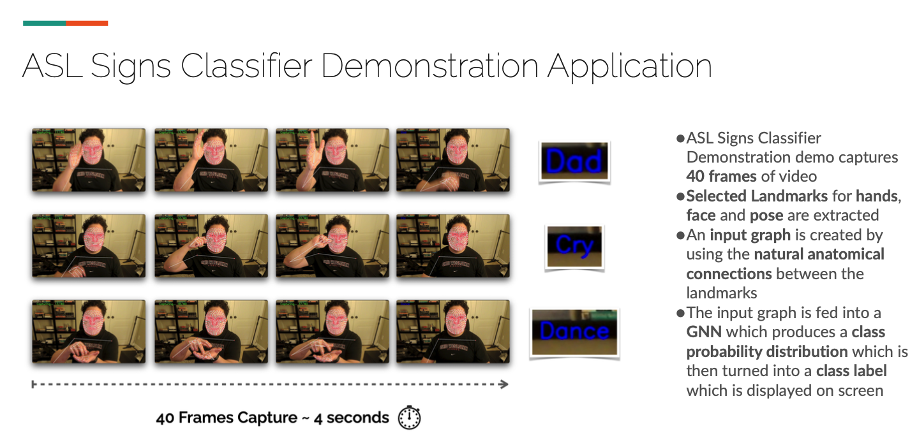

# Realtime Isolated ASL Gesture Sequence Recognition with GNNs

A machine learning project for real-time American Sign Language (ASL) recognition using Graph Neural Networks (GNNs) and Random Forest classifiers. This project bridges communication gaps between the deaf/hard-of-hearing community and hearing population by translating ASL gestures into English in real-time.



**[📹 Watch Demo Video](docs/demo.mp4)** - See the real-time ASL recognition system in action

## Overview

This project addresses the challenge of ASL-to-English translation through two complementary approaches:

1. **ASL Alphabet Fingerspelling**: Detects and classifies hand shapes corresponding to ASL manual alphabet letters using Random Forest models
2. **Isolated ASL Signs Classifier**: Processes live video to classify sequences of hand, face, and body gestures representing complete ASL signs using Graph Neural Networks

The system leverages MediaPipe for landmark extraction and employs spatiotemporal graph representations to capture both the spatial configuration and temporal dynamics of sign language gestures.

## Project Context

This work was developed as part of Harvard University's DGMD E-14: Wearable Devices and Computer Vision course. The project explores emerging Graph Neural Network architectures for skeleton-based action recognition, specifically applied to the domain of sign language translation.

**Research Team**: Julia Beltrame, Wilson Guo, Brian Sam-Bodden, Taha Teke

## Key Features

- **Real-time Recognition**: Processes webcam video at ~10 FPS for immediate gesture classification
- **Dual-Model Architecture**: Combines Random Forest for static fingerspelling and GNNs for dynamic isolated signs
- **Landmark-Based Approach**: Extracts 118 key landmarks (hands, face, pose) from 543 available MediaPipe points for efficient processing
- **Spatiotemporal Graphs**: Constructs graphs with anatomical connections (spatial edges) and frame-to-frame links (temporal edges)
- **Temporal Feature Engineering**: Incorporates velocity and acceleration features alongside spatial coordinates

## Technical Approach

### Data Processing Pipeline

1. **Landmark Extraction**: MediaPipe Holistic model extracts 3D landmarks (x, y, z coordinates)
2. **Feature Selection**: Reduces to 118 critical landmarks:
   - All 21 landmarks per hand (42 total)
   - ~60 minimal face landmarks (outline, eyes, lips)
   - 7 pose landmarks from waist up (excluding hands/wrists)
3. **Temporal Interpolation**: Normalizes videos to 40 frames using interpolation/downsampling
4. **Feature Engineering**: Calculates velocity and acceleration between consecutive frames
5. **Graph Construction**: Creates spatiotemporal graphs with natural anatomical connections

### Model Architectures

#### Random Forest Fingerspelling Classifier

- **Purpose**: Static ASL alphabet recognition (A-Z)
- **Configuration**: 20 tree classifiers at depth 5
- **Performance**: ~95% test accuracy on custom dataset
- **Features**: Hand landmark coordinates and inter-finger spatial relationships

#### Graph Neural Network (GCN) for Isolated Signs

- **Architecture**: Spectral Graph Convolutional Network
- **Layers**:
  - GCNConv: 6 → 512 features
  - GCNConv: 512 → 1024 features
  - Linear: 1024 → 512
  - Linear: 512 → num_classes
- **Regularization**: BatchNorm, LayerNorm, Dropout (p=0.7), L1/L2 regularization
- **Input**: 6 features per node (x, y, velocity_x, velocity_y, acceleration_x, acceleration_y)
- **Performance**: Up to 82% validation accuracy on 6-class subset

### Dataset

- **Source**: [Google - Isolated Sign Language Recognition](https://www.kaggle.com/competitions/asl-signs) (Kaggle)
- **Scale**: 250 ASL signs from 21 participants
- **Demo Models**: Trained on 6-sign subset (Dad, TV, Flower, Dance, Cry, Call Me) and 20-sign subset
- **Format**: Parquet files containing MediaPipe landmark sequences per video frame

## Results

Multiple GNN model sizes were evaluated (XS, S, M, L, XL):

| Model | Validation Accuracy | Training Epochs |
|-------|-------------------|-----------------|
| XS    | 79.3%            | 100             |
| S     | 81.6%            | 100             |
| M     | 80.7%            | ~40-50          |
| **L** | **82.0%**        | ~40-50          |
| XL    | 80.9%            | ~40-50          |

**Key Findings**:

- Larger models converge faster (50% fewer epochs) while achieving similar accuracy
- Smaller models show promise for compute-constrained/on-device deployment
- Random Forest achieves high accuracy for static alphabet recognition
- GNN effectively captures spatiotemporal dynamics of sign sequences

## Setting up your Environment

To run the code locally, you'll need to install and setup a few things:

- Python 3 (if you don't have a recent version of Python, [grab one here](https://www.python.org/downloads/).  We've tested on Python 3.10)
- Poetry (dependency manager for Python - [read the installation instructions here](https://python-poetry.org/docs/#installation))
- Git command line tools (the `git` command).  Get these from [the Git website](https://git-scm.com/downloads) if needed.

## Cloning this Repository

At the terminal, clone the repository to your local machine:

```bash
git clone https://github.com/bsbodden/ASL_with_GNNs.git
```

Then, change directory into the repository folder:

```bash
cd ASL_with_GNNs
```

## Installing Python Dependencies

We're using the Poetry tool to manage Python virtual environments and dependencies.  Install the dependencies that this workshop uses with the following command:

```bash
poetry install
```

## Running the Experiments

### Pose Landmarker Demo

Based on <https://developers.google.com/mediapipe/solutions/vision/pose_landmarker/python>

```bash
poetry run python PoseLandmarkerDemo.py
```

### Hand Landmarker Demo

Based on <https://developers.google.com/mediapipe/solutions/vision/hand_landmarker/python#live-stream>

```bash
poetry run python HandLandmarkerDemo.py
```

### Hand Landmarker Finger Counting Demo

Reverse engineering of this Video <https://www.youtube.com/watch?v=p5Z_GGRCI5s> (this was bad code and for an ancient version of MediaPipe)

```bash
poetry run python HandLandmarkerFingerCounterDemo.py
```

### Hand Gesture Classification Demo

Reverse engineering of this Video <https://www.youtube.com/watch?v=p5Z_GGRCI5s> (this was bad code and for an ancient version of MediaPipe)

```bash
poetry run python HashGestureClassificationDemo.py
```

### Face Landmarker Demo

Reverse engineering of this Video <https://www.youtube.com/watch?v=p5Z_GGRCI5s> (this was bad code and for an ancient version of MediaPipe)

```bash
poetry run python FaceLandmarkerDemo.py
```

### LandmarksPlayer

A tkinter app to visualize the data set from <https://www.kaggle.com/competitions/asl-signs/data> - download the zip file
and unzip it somewhere in your computer, say `~/Desktop/asl-signs` then make a copy of `.env-examples`, rename it to `.env`
and change the environment property `ASL_SIGNS_BASE_DIRECTORY` to point to the `asl-signs` folder.

```bash
poetry run python LandmarksPlayer.py
```

### ASL Recognition Demo (GNN-based)

Real-time isolated ASL sign recognition using the trained GNN model. The application:

- Captures 40 frames of video (~4 seconds)
- Extracts selected landmarks for hands, face, and pose
- Constructs an input graph using natural anatomical connections
- Feeds the graph into the GNN to produce a class probability distribution
- Displays the predicted sign label on screen

The demo recognizes 6 ASL signs: Dad, TV, Flower, Dance, Cry, and Call Me.

```bash
poetry run python ASLRecognitionDemo.py
```

**Note**: Requires pre-trained model weights in `models/` directory. The best performing model (L size, 82% validation accuracy) is included as `Best-GNN-5-Weights.pth`.

To quit any of the demos, press "q"

## Future Research Directions

This project opens several avenues for future exploration:

1. **Landmark Combination Analysis**: Systematic evaluation of which landmark combinations (hands, face, pose) carry the most semantic information for ASL recognition
2. **Advanced Feature Engineering**: Exploring targeted feature extraction (e.g., hand configuration classification) to reduce dimensionality
3. **Enhanced Temporal Features**: Investigating optical flow and other motion capture techniques beyond basic velocity/acceleration
4. **Alternative GNN Architectures**:
   - 3D Convolutional Neural Networks (3D CNNs)
   - Time-Distributed CNNs
   - Temporal Convolutional Networks (TCNs)
   - Attention-based temporal models
5. **Hardware Integration**: Exploring smart glove sensors for more robust spatial relationship capture
6. **Continuous Sign Language**: Extending from isolated signs to continuous ASL sentence recognition
7. **On-Device Deployment**: Optimizing models for mobile/edge devices with limited compute

## Course Publications

This work was presented at Harvard University and documented in:

- **[Presentation Slides](docs/presentation.pdf)**: "Realtime Isolated ASL Gesture Sequence Recognition" - DGMD E-14 Final Project presentation covering project summary, methodology, GNN architecture, and experimental results
- **[Technical Report](docs/report.pdf)**: "Landmark-based American Sign Language Recognition using GNNs" - Comprehensive academic paper detailing the research background, methodology, data processing pipeline, model architectures, experimental results, and future directions

## Related Work & References

This project builds upon several key research areas:

- **Sign Language Recognition**: Kumar et al. (2018) - Time Series Neural Networks for Real-Time Sign Language Translation
- **Graph Neural Networks**: Cao et al. (2020) - Spatial Temporal Graph Convolutional Networks for Skeleton-Based Action Recognition
- **MediaPipe Integration**: Samaan et al. (2022) - MediaPipe's Landmarks with RNN for Dynamic Sign Language Recognition
- **Temporal Graphs**: Scarselli et al. (2023) - Graph Neural Networks for Temporal Graphs

Full references and citations available in the [technical report](docs/report.pdf).

## Contributing

This is an academic research project, but contributions are welcome! Areas where contributions would be valuable:

- Additional ASL sign training data
- Model optimization and hyperparameter tuning
- Alternative graph construction strategies
- Deployment to mobile/web platforms
- Extended sign vocabulary

## License

MIT

## Citation

If you use this work in your research, please cite:

```bibtex
@misc{sambodden2023asl,
  title={Landmark-based American Sign Language Recognition using GNNs},
  author={Sam-Bodden, Brian and Beltrame, Julia and Teke, Taha and Guo, Wilson},
  year={2023},
  institution={Harvard University}
}
```

## Acknowledgments

- Harvard University DGMD E-14: Wearable Devices and Computer Vision
- Google Kaggle for the ASL Signs dataset
- MediaPipe team for the landmark detection framework
- PyTorch Geometric community
